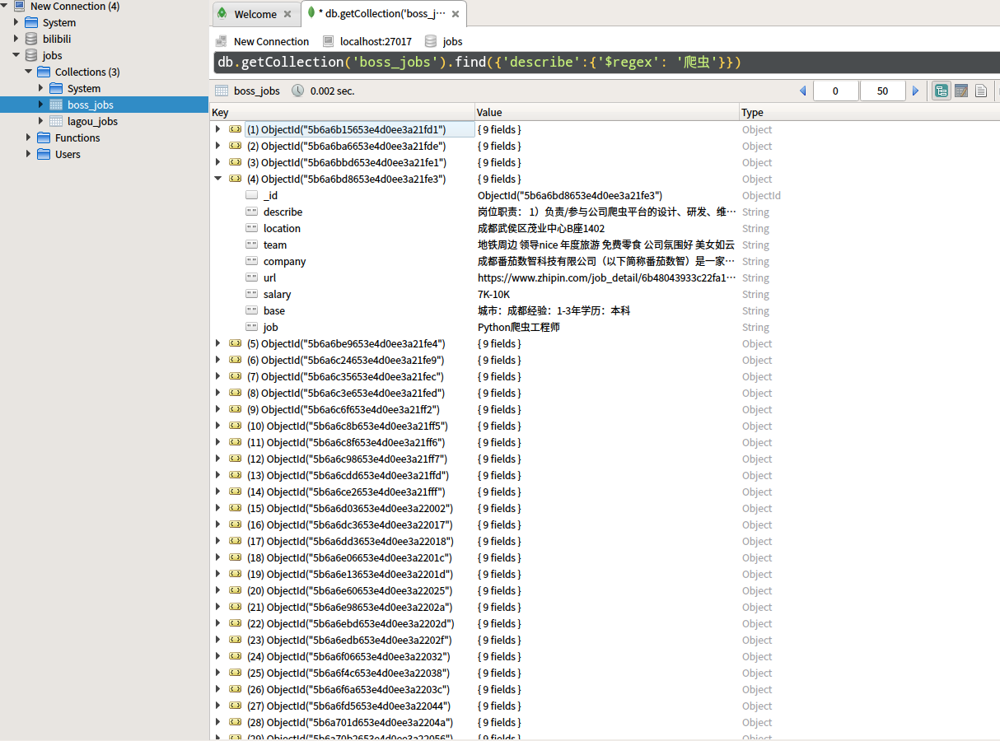

<h2>尝试模拟登陆boss直聘网站</h2>

从 boss直聘登陆页面可得到验证码的 key,通过它下载得到验证码,识别后输入验证码值
 

(尝试使用 tesserocr 识别验证码失败后，采用人脸识别)
 

输入得到验证码后，会发送验证码到手机。输入之后即可完成登陆。结果如下：

将结果存储到 mongodb,如图：

对爬取到的数据查询，可以得到在描述中带有‘爬虫’关键字的的具体数据，如图所示:

尽量采用<strong>代理 ip<strong> 进行爬取，当然，有多个账号进行爬取最好

由于程序需要手动输入网页验证码，以及手机验证码，所以暂不考虑多进程的执行
